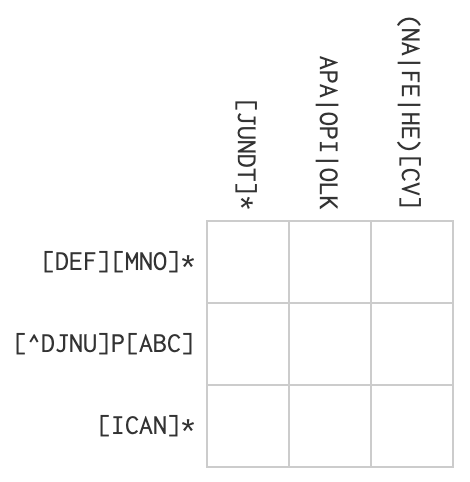
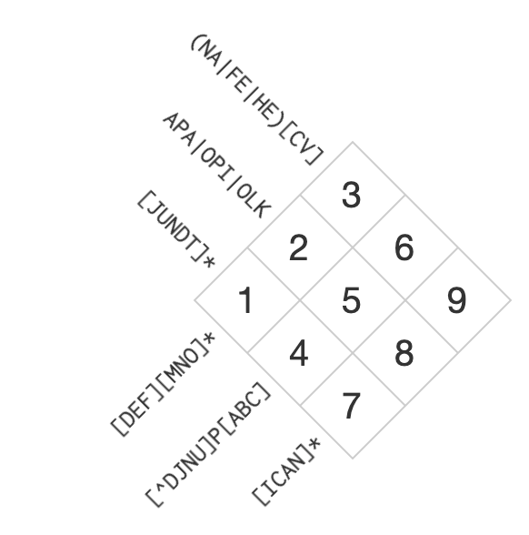

# QMSS G5072 Homework 5
Thomas Brambor  

# Working with Strings

## Emergency Hospital Injuries 

The file `emergency.csv` contains a random sample of 10,000 narratives of injuries treated in U.S. emergency departments. We will try to extract some structured data from these narratives.

#### a) Length of Narratives

Read in the data. Find and display the longest and shortest description.

#### b) Fractures

Find all narratives related to "fractures". Try to include singular/plural/verb forms in your search. Also, `FX` is the medical abbreviation for fracture, so include that as well. How many fracture narratives can you find?

#### c) Body Parts

Among the fracture narratives, try to identify the body parts that are fractured (_Note_: Don't go overboard. A selection of parts is sufficient.). Make a histogram of fractured body parts (but make sure plural and singular forms are combined.)

#### d) Age and Gender

Let's try to extract age and gender. In a number of narratives you may have noticed a pattern:

  * "**75 YOM**, FELL DOWN STAIRS, FRACTURE LEG": A 75 year old male.
  * "**21MOF** FINGER SHUT IN WINDOW AT HOME;NAILBED INJURY: A 21 month-old female child.
  * "DX:AVULSION OF SKIN-**50YOF**-CUT THUMB WITH SCISSORS TONIGHT-OPENING A BOX": A 50 year old female.
  * "LEFT ELBOW CONTUSION,RT SHIN LAC.PT WAS ICE SKATING AND FELL.": No information about age or gender.
  
  You are generally looking for a pattern with a number (_age_), something to indicate the _units_, e.g. YO or YR for years old, or MO for months old, and a character that identifies the _gender_. So, I suggest to think of a pattern that combines these three parts. 
  
  Create variables for age and gender (make sure to convert months to years when necessary). How many men and women are in the data? Provide a graphical representation of the number of injuries (y-axis) vs age / age group (x-axis) disaggregated by gender.
 
# Optional (Bonus): Regex Crossword

Let's have a bit of fun with some regex crossword puzzle. 

(A) Here is a Regex crossword. The clues in the rows and columns provide you with a way to fill the 9 boxes with individual letters. 
 

(B) Here is the same crossword (tilted to make it a bit more readable). The solution should provide which letters correspond to each of the nine numbered cells. 

## Submit your homework

Please follow the [instructions](/Exercises/homework_submission_instructions.md) to submit your homework. The homework is due on Wednesday, October 19 at 5pm.
